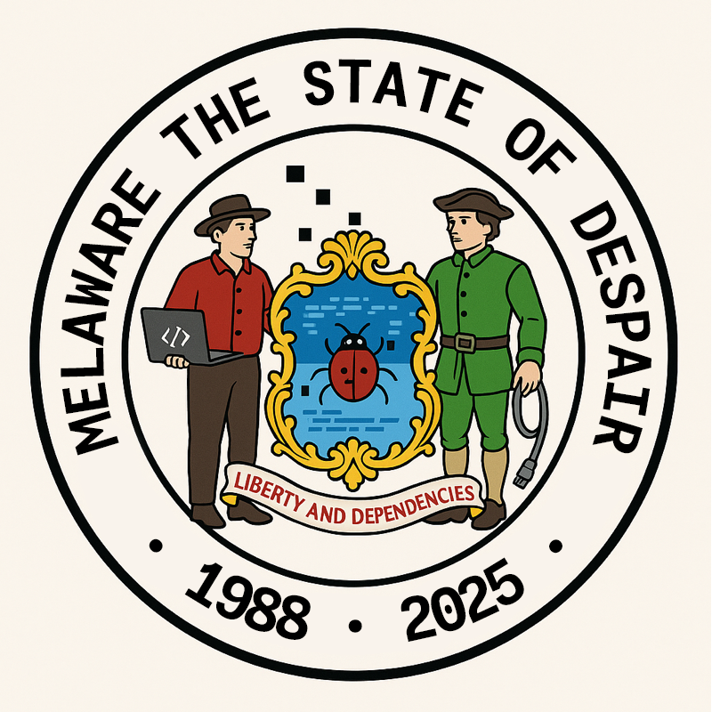

  

<h1 align="center">Melaware – The State of Despair</h1>

<i>Totally not state-sponsored. Barely developer-sponsored.</i>

---

## 🐞 Welcome to Melaware — The State of Despair

This is the official–unofficial home of **Melaware**, a fake digital jurisdiction where:

- Builds are always red  
- Dependencies are never up to date  
- And every “quick fix” adds three new bugs

Think of this org as a **museum of bad ideas for the web**:
delightfully cursed HTML, over-engineered JavaScript, and CSS that only works on our machines.

This is **not** a normal GitHub org.  
This is a graveyard of web-dev decisions we absolutely should not be proud of, and yet, here we are.

---

## What You’ll Find Here (Abandon Hope, etc.)

### Cursed Frontends
- CSS written entirely in the bargaining phase of grief  
- Layouts held together entirely by `position: absolute;` and denial  
- JavaScript so tightly coupled it’s basically trauma-bonded

### Maladvised experiments 
  - Over-nested components  
  - Over-promised comments, under-delivered logic  

### Over-Engineered “Solutions”
- A TODO list app powered by:
  - 1 monorepo  
  - 3 microservices  
  - 2 message queues  
  - And 0 justification  
- Hooks that call hooks that call hooks that call therapy

### Mock “Malware”
All fake, all vibes:

- `totally_not_ransomware.js` – just logs insults to the console  
- `worm.js` – crawls your DOM, judges it silently  
- Sample APIs whose only guarantee is a 500 at the worst possible time

> **Important:**  
All of it is **for fun, education, and roasting our own bad habits** —  
**no real malware, no exploits, no shady stuff.**

---

## Our Motto: “Liberty and Dependencies”

In the proud spirit of Melaware:

- We believe in **freedom of bugs**  
- Every citizen has the right to install **one more library** they don’t understand 
- And we put our faith in `node_modules` (even though we really shouldn’t)

---

## Suggested Ways to Suffer

- Clone a repo and try to understand the folder structure  
- Open `package.json` and whisper “why” to yourself  
- Run `npm install` and listen closely to the cooling fans: that’s the sound of Melaware accepting you

---

## FAQ (Frequently Asked “WHY?!”)

**Q: Is this safe to run?**  
**A:** Emotionally? No. Technically? Mostly. There is **no real malware**, just aggressively bad taste.

**Q: Is any of this dangerous?**  
**A:** Only to your sense of best practices.

**Q: Are you actually hackers?**  
**A:** We once `git push`ed to the wrong remote and took down staging. Does that count?

**Q: Can I use this in production?**  
**A:** You *can*. You *shouldn’t*. But you can.
If you do, please consult a professional (therapist or SRE, your choice).

---

## Contributing to the Chaos

Want to file for Melaware citizenship?

1. Fork a repo 
2. Make it worse in a *creative* way.. Add something gloriously unnecessary (extra layers of abstraction welcome)
3. Open a PR titled something like:
   - `hotfix: definitely made it better`
   - `quick hack, please don’t read`
   - `works on my localhost`

Guidelines:

- No real malicious code  
- No security exploits  
- No hate, bigotry, harassment,or real-world harm  
- Do feel free to roast your own code in the comments

---

## “Legal” Disclaimer

- Not affiliated with any real government

By viewing, cloning, or even thinking about this code, you agree that:

- You understand this is **a joke project**  
- You will not blame Melaware for your own mistakes  

If a repo name sounds dangerous, it’s probably just some broken JavaScript,
an HTML file, and a dream.

---

  <i>Welcome to Melaware. 
  May your bugs be shallow, your stack traces short, and your prod incidents purely hypothetical.</i>

